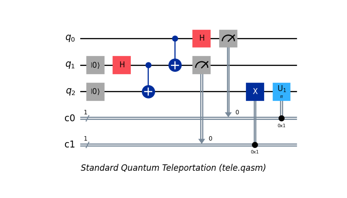
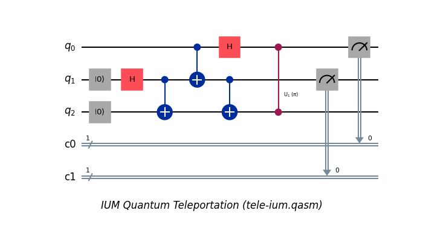
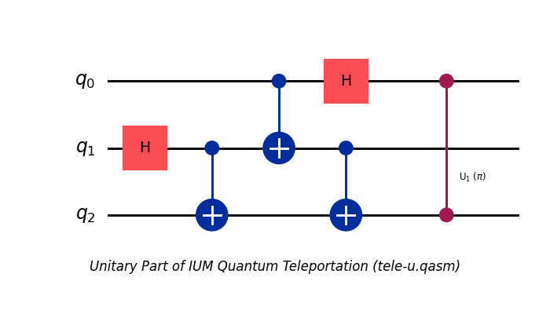
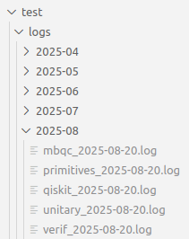
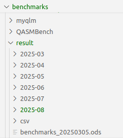
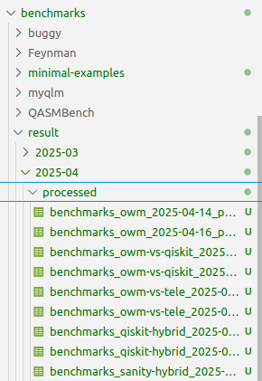
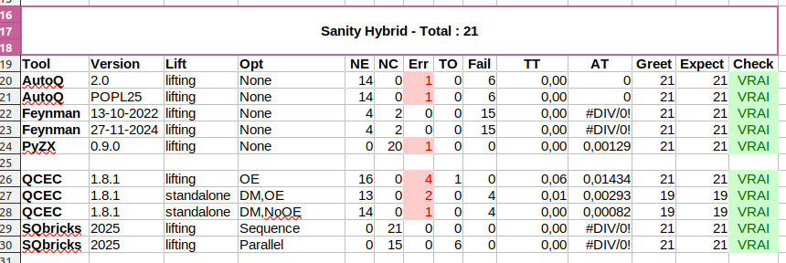
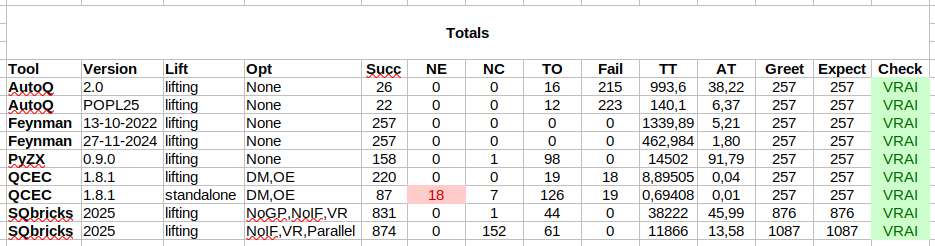

<!--
  This file is part of SQbricks.

  Copyright (C) 2022-2026
  CEA (Commissariat à l'énergie atomique et aux énergies alternatives)
  Université Paris-Saclay

  you can redistribute it and/or modify it under the terms of the GNU
  Lesser General Public License as published by the Free Software
  Foundation, version 2.1.

  It is distributed in the hope that it will be useful,
  but WITHOUT ANY WARRANTY; without even the implied warranty of
  MERCHANTABILITY or FITNESS FOR A PARTICULAR PURPOSE.  See the
  GNU Lesser General Public License for more details.

  See the GNU Lesser General Public License version 2.1
  for more details (enclosed in the file licenses/LGPLv2.1).
-->


# SQbricks

**SQbricks** is a verification tool for hybrid circuits.

In SQbricks, a *hybrid circuit* refers to a quantum circuit that includes both quantum operations (unitaries), measurements, and classical control.

SQbricks is composed of two complementary tools: **SQbricks-Lift (SQL)** and **SQbricks-Verif (SQV)**.

---

## SQbricks-Lift (SQL)

**SQbricks-Lift** implements a transformation based on the *deferred measurement* principle, which pushes all *Initialization (I)* to the beginning and *Measurements (M)* to the end of the circuit. This enables the use of standard unitary verification tools in the broader context of hybrid circuits — effectively *lifting* them to this extended setting.

Two transformation modes are provided:

- **IUM**: Returns an *Initialization–Unitary–Measurement (IUM)* decomposition of the circuit.
- **U**: Returns only the unitary part of the circuit.

---

## SQbricks-Verif (SQV)

**SQbricks-Verif** is used to verify the equivalence of two unitary circuits, even if they differ in the number of qubits. This supports the common scenario where auxiliary or "garbage" qubits are added for intermediate computations.

Two verification algorithms are available:

- **Parallel Algorithm (`par`)**:
  Executes both circuits on the same input and compares their outputs.

- **Sequence Algorithm (`seq`)**:
  Executes one circuit followed by the inverse of the other and verifies that the output matches the initial input state.
  **The `seq` algorithm typically yields better results than `par`, but requires that at least one of the circuits has no ancilla.**

---

## Licence

- Docker: [licence](https://www.docker.com/legal/docker-software-end-user-license-agreement/)
- OCaml: [licence](https://github.com/ocaml/ocaml/blob/trunk/LICENSE)
- Qiskit: [licence](https://github.com/Qiskit/qiskit/blob/main/LICENSE.txt)
- OpenQASM: [licence](https://github.com/openqasm/openqasm/blob/main/LICENSE)
- Matplotlib: [licence](https://github.com/matplotlib/matplotlib/blob/main/LICENSE/LICENSE)
- AutoQ: [licence](https://github.com/fmlab-iis/AutoQ/blob/main/LICENSE)
- Feynman: [licence](https://github.com/meamy/feynman/blob/master/LICENSE.md)
- PyZX: [licence](https://github.com/zxcalc/pyzx/blob/master/LICENSE)
- QCEC: [licence](https://github.com/munich-quantum-toolkit/qcec/blob/main/LICENSE.md)
- QASMBench: [licence](https://github.com/pnnl/QASMBench/blob/master/LICENSE)
- VeriQBench: [Git](https://github.com/Veri-Q/Benchmark)
- VeriQC: [Git](https://github.com/Veriqc/EC-for-Dynamic-Quantum-Circuits)

---

## Features

- Supports input in **OpenQASM 2.0** format.
- Packaged as a **Docker container** with all necessary dependencies.

---

## Installation

1. Install Docker: [https://docs.docker.com/get-started/get-docker/](https://docs.docker.com/get-started/get-docker/)
2. Build the Docker image:

```bash
make build
```

Alternative, pull the Docker image:

```bash
make pull
```

4. Create the container:

```bash
make container
```

4. Start the container:

```bash
make start
`````

## Usage

### Compilation (inside the container)

```bash
dune build
```

### SQbricks-Lift

#### Generate U/IUM:

```bash
-sql <dm> <in.qasm> <out.qasm>

```
Applies the deferred measurement to [in.qasm].

- `in.qasm`: Input QASM file
- `out.qasm`: Output QASM file
- `dm`: Deferred Measurement type, `u` (unitary circuit) or `ium`
  (initialised-unitary-measurement circuit)
- `Return`: List of measurements index


---

#### Example: Teleportation

Input = `q0`, Output = `q2`.

* **Input Circuit** (`tele.qasm`)
```qasm
OPENQASM 2.0;
include "qelib1.inc";
qreg q[3];
creg c0[1];
creg c1[1];
reset q[1];
reset q[2];
h q[1];
cx q[1], q[2];
cx q[0], q[1];
h q[0];
measure q[0] -> c0[0];
measure q[1] -> c1[0];
if (c1 == 1) x q[2];
if (c0 == 1) u1(pi/1) q[2];
```



* **Transformation to IUM (Initialization-Unitary-Measurement)**
```bash
dune exec -- ./bin/main.exe -sql ium \
    benchmarks/minimal-examples/tele.qasm \
    benchmarks/minimal-examples/tele-ium.qasm
```

* **Output Circuit (`tele-ium.qasm`)**
```qasm
OPENQASM 2.0;
include "qelib1.inc";
qreg q[3];
creg c0[1];
creg c1[1];

// Initialization
reset q[1];
reset q[2];

// Unitary
h q[1];
cx q[1], q[2];
cx q[0], q[1];
h q[0];
cx q[1], q[2];
cu1(pi/1) q[0], q[2];

// Measurement
measure q[0] -> c0[0];
measure q[1] -> c1[0];
```



* **Transformation to U (Unitary)**
```bash
dune exec -- ./bin/main.exe -sql u \
    benchmarks/minimal-examples/tele.qasm \
    benchmarks/minimal-examples/tele-u.qasm
```

* **Output Circuit** (`tele-u.qasm`)
```qasm
OPENQASM 2.0;
include "qelib1.inc";
qreg q[3];

// Unitary
h q[1];
cx q[1], q[2];
cx q[0], q[1];
h q[0];
cx q[1], q[2];
cu1(pi/1) q[0], q[2];
```



### SQbricks-Verif

```bash
dune exec -- ./bin/main.exe -sqv <a> <e> <c1.qasm> <c2.qasm> [in1] [in2] [out1] [out2] [m1] [m2] <v>
```

#### Parameters
- `a`: Algorithm type, `seq` (sequential) or `par` (parallel)
- `e`: Equivalence type, `s` (SubCircuit), or `g` (GlobalPhase)
- `c1`: Path to first QASM file (e.g. `qft.qasm`)
- `c2`: Path to second QASM file (e.g. `qft_owm.qasm`)
- `in1`: Input qubits for first circuit (e.g. `[0;1]`)
- `in2`: Input qubits for second circuit (e.g. `[0;1]`)
- `out1`: Output qubits for first circuit (e.g. `[0;1]`)
- `out2`: Output qubits for second circuit (e.g. `[0;1]`)
- `m1`: Measured qubits for first circuit (e.g. `[0;1]`)
- `m2`: Measured qubits for second circuit (e.g. `[0;1]`)
- `v`: Enable verbose output (e.g. `true`)


**The size of the lists `[in2]` and `[out2]` must be equal to the size of the register of `c2`.**

The **result of an equivalence check** can be either `GlobalPhaseEquivalent` or `SubCircuitEquivalent`.
The first does not take into account the global phase (up to global phase), while the second does take into account the global phase.


#### Example: Teleportation

Input = `q0`, Output = `q2`.

* **Sequence Algorithm (`s`)**

```bash
dune exec -- ./bin/main.exe -sqv seq s \
  benchmarks/minimal-examples/tele-u.qasm \
  benchmarks/minimal-examples/id.qasm \
  "[0]" "[0]" "[2]" "[0]" "[0;1]" "[]" true
```
* **Output**
```bash
...
Equiv: SubCircuitEquivalent, 
Execution time = 0.000265 seconds, Memory = 0.018910 MB
```

* **Parallel Algorithm (`p`)**

```bash
dune exec -- ./bin/main.exe -sqv par s \
  benchmarks/minimal-examples/tele-u.qasm \
  benchmarks/minimal-examples/id.qasm \
  "[0]" "[0]" "[2]" "[0]" "[0;1]" "[]" true
```

* **Output**
```bash
...
inputs1=[0], inputs2=[0], outputs1=[2], outputs2=[0], meas1=[0;1], meas2=[]
Equiv.parallel,
output_path_var_norm1 =
  phase = e^{2.π.i.(0)};
  ket =  |y0,y1,x0>;
  path_var = [y0;y1];

Equiv.parallel,
output_path_var_norm2 =
  phase = e^{2.π.i.(0)};
  ket =  |x0>;
  path_var = [];

Equiv: SubCircuitEquivalent, 
Execution time = 0.000056 seconds, Memory = 0.006889 MB
```

### SQbricks: **Hybrid Circuit Verification (SQL + SQV)**:

#### Parameters
 |  Parameter   | Type               | Description                                                            | Required |
 |-------------|--------------------|-------------------------------------------------------------------------|----------|
 | `c1.qasm`, `c2.qasm`   | File (QASM)      | Path to input hybrid circuit.           | Yes      |
 | `v` | Boolean (`true`/`false`) | Enable detailed logs and additional information during execution.   | No       |

#### Algorithms

* **Sequence Algorithm (`s`)**:

```bash
dune exec -- ./bin/main.exe -sq s <c1.qasm> <c2.qasm> v
```

\* **`c2` has no discard or initialization.**


**Parallel Algorithm (`p`)**:

```bash
dune exec -- ./bin/main.exe -sq p c1.qasm c2.qasm v
```

#### Example: Teleportation

Input = `q0`, Output = `q2`.

* **Sequence Algorithm (`seq`)**

```bash
dune exec -- ./bin/main.exe -sq seq s \
  benchmarks/minimal-examples/tele.qasm \
  benchmarks/minimal-examples/id.qasm \
  true
```
* **Output**
```bash
...
Equiv: SubCircuitEquivalent, 
Execution time = 0.000334 seconds, Memory = 0.018908 MB
```
* **Parallel Algorithm (`par`)**

```bash
dune exec -- ./bin/main.exe -sqv par s \
  benchmarks/minimal-examples/tele.qasm \
  benchmarks/minimal-examples/tele.qasm \
  true
```
* **Output**
```bash
...
Equiv: SubCircuitEquivalent, 
Execution time = 0.000054 seconds, Memory = 0.006890 MB
```

# Experimentation

## Structure

| Designation     | Location     | Description                                                                 |
|-----------------|--------------|-----------------------------------------------------------------------------|
| Source Code     | `lib/`       | Core source code of **SQbricks**                                            |
| Executable      | `bin/`       | Main entry point of **SQbricks**                                            |
| Parser          | `parser/`    | Parsers for **OpenQASM circuits** and **Path-Sum specifications**           |
| Scripts         | `scripts/`   | Contains helper scripts: benchmarks (`benchmarks.sh`), equivalence checking with QCEC (`mqt-qcec-qiskit.py`), and Qiskit transpilation scripts |
| Unit Tests      | `tests/`     | Test files for unit testing. Results are stored in `logs/`                  |
| Tools           | `tools/`     | External tool binaries used by SQbricks                                     |


## Tests

### Overview

| Designation              | Location                           | Description                                                                 |
|---------------------------|------------------------------------|-----------------------------------------------------------------------------|
| Primitive Tests  | `tests/primitives.ml`        | Basic unit tests for primitive components                                   |
| Functional (Unitary) | `tests/unitary.ml`, `tests/qiskit.ml` | Functional equivalence tests for **unitary circuits**          |
| Functional (Hybrid)  | `tests/mbqc.ml` | Functional equivalence tests for **hybrid circuits**          |
| Functional (Specifications) | `tests/verif.ml` | Functional tests for **specification-based verification** (Path-Sum)     |

### Usage

| Command               | Description                                                                 |
|------------------------|-----------------------------------------------------------------------------|
| `make tests_prim`      | Run unit tests on primitive components                                      |
| `make tests_unit`      | Run functional equivalence tests on unitary circuits                        |
| `make tests_qiskit`    | Run functional equivalence tests between an original circuit and its Qiskit-transformed version |
| `make tests_mbqc`      | Run functional equivalence tests on hybrid circuits with **discard**                       |
| `make tests_verif`     | Run functional tests for specification-based verification (Path-Sum)        |
| `make tests`           | Run **all** tests                                                           |

### Output Location



### Output
**Example: Functional tests hybrid with discard**
```bash
Testing `Symbolic execution'.
This run has ID `8RFVTPUJ'.

  [OK]          OWM vs Teleportation            0   h 0.
  [OK]          OWM vs Teleportation            1   h 2.
  [OK]          OWM vs Teleportation            2   hh 0.
  ...
  [OK]          Teleportation Parallel          0   h 0.
  ...
  [OK]          OWM Parallel                    0   id.
  ...
  [OK]          Teleportation                  72   qft4.
  [OK]          Teleportation                  73   false_teleportation qft4.

Full test results in `/sqbricks/_build_mbqc/default/test/_build/_tests/Symbolic execution'.
Test Successful in 1.110s. 377 tests run.

```

## Tools

| Tool     | Version       | Git Repository                                                                 | Execution Path                              | Associated Paper                                                                                     |
|----------|---------------|---------------------------------------------------------------------------------|---------------------------------------------|------------------------------------------------------------------------------------------------------|
| AutoQ    | `POPL25`      | [AutoQ](https://github.com/fmlab-iis/AutoQ/tree/POPL25ae)                       | `tools/AutoQ-POPL25` (Binaries)             | [Verifying Quantum Circuits with Level-Synchronized Tree Automata](https://dl.acm.org/doi/10.1145/3704868) |
| AutoQ    | `2.0`         | [AutoQ-2](https://github.com/fmlab-iis/AutoQ/tree/2.0)                          | `tools/AutoQ-2.0` (Binaries)                | [https://arxiv.org/abs/2411.09121](https://arxiv.org/abs/2411.09121)                                                                                   |
| Feynman  | `13-10-2022`  | [Feynman](https://github.com/meamy/feynman/tree/56e5b771309e582144e6b9fd52fa5d2ccfe16b73) | `tools/Feynman_13-10-2022` (Binaries)       | [Towards Large-scale Functional Verification of Universal Quantum Circuits](https://arxiv.org/abs/1805.06908) |
| Feynman  | `28-11-2024`  | [Feynman](https://github.com/meamy/feynman/tree/8e7aeb70235eeaf808eaf6172dff1a19b1d49242) | `tools/Feynman_28-11-2024` (Binaries)       | [Linear and non-linear relational analyses for Quantum Program Optimization](http://arxiv.org/abs/2410.23493)      |
| PyZX     | `0.9.0`       | [PyZX](https://github.com/zxcalc/pyzx)                                          | `python3 scripts/pyzx_verify.py`            | [PyZX: Large Scale Automated Diagrammatic Reasoning](http://arxiv.org/abs/1904.04735) |
| QCEC     | `2.8.1`       | [QCEC](https://github.com/munich-quantum-toolkit/qcec)                          | `python3 scripts/mqt-qcec-qiskit.py`        | [Handling Non-Unitaries in Quantum Circuit Equivalence Checking](http://arxiv.org/abs/2106.01099) |


## Circuits collection (OpenQASM 2)

| Name       | Location                 | Source | Description | Associated Paper |
|:-----------|-------------------------|-------:|-------------|----------------|
| Feynman    | `benchmarks/Feynman`    | [Feynman Library](https://github.com/meamy/feynman/tree/master/benchmarks/qasm) | Unitary circuits (Toffoli, GF2, Grover, …); extra Hadamard gates were added to test verification robustness. | [Towards Large-scale Functional Verification of Universal Quantum Circuits](https://arxiv.org/abs/1805.06908) |
| QASMBench  | `benchmarks/QASMBench`  | [QASMBench](https://github.com/pnnl/QASMBench) | Unitary and hybrid circuits. | [QASMBench: A Low-level QASM Benchmark Suite for NISQ Evaluation and Simulation](http://arxiv.org/abs/2005.13018) |
| VeriQbench | `benchmarks/VeriQbench` | [VeriQbench](https://github.com/Veri-Q/Benchmark) | Unitary and hybrid circuits. | [VeriQBench: A Benchmark for Multiple Types of Quantum Circuits](http://arxiv.org/abs/2206.10880) |
| VeriQC     | `benchmarks/VeriQC`     | [VeriQC](https://github.com/Veriqc/EC-for-Dynamic-Quantum-Circuits/tree/main/Benchmarks2) | Hybrid dynamic circuits. | [Equivalence Checking of Dynamic Quantum Circuits](http://arxiv.org/abs/2106.01658) |


## Sanity check {#sanity-check}

### Usage

| Command       | Description | 
|:-----------|-------------------------|
| `make sanity-unit`    |  Sanity check sur les circuits unitaires    |
| `make sanity-hybrid`    |  Sanity check sur les circuits hybrides    |
| `make sanity-partial`    |  Sanity check sur les circuits hybrides avec **discard**    |
| `make sanity`    |  Lance tous les sanity check    |

### Output

The output of the sanity check (like benchmark results) is stored as a CSV file in a folder as `benchmarks/result/<date>/`.

The table below shows a portion of the output from the **hybrid sanity check without discard**.  

- The last column `Time` being empty indicates that the sanity check **passed for all tools**.  
- If a time appears in `Time`, the tool **failed the sanity check**, as it incorrectly verified equivalence between two non-equivalent circuits.  

Column descriptions:  

- `Program1` and `Program2`: Names of the programs under sanity check  
- `Tool` and `Version`: Tool name and version  
- `Opt`: Tool-specific options (`DM` = delayed measurement, `OE` = partial equivalence, `Sequence` = sequential algo, `Parallel` = parallel algo)  
- `Lift`: Indicates whether delayed measurement (`SQL`) was applied (`standalone` = no, `lifting` = yes)  
- Remaining columns: Gate counts  

| Program1 | Program2 | Tool     | Version   | Lift       | Opt          | CH | CS | CZ | CCZ | CCX | CU1 | Gates | Time |
|----------|----------|----------|----------|------------|--------------|----|----|----|-----|-----|-----|-------|------|
| shor_n5_ancillas | shor_n5_ancillas_FALSE_angle | QCEC    | 1.8.1     | standalone | DM,OE       | 0  | 7  | 0  | 0   | 22  | 5   | 60    | Err1 |
| shor_n5_ancillas | shor_n5_ancillas_FALSE_angle | QCEC    | 1.8.1     | standalone | DM,NoOE     | 0  | 7  | 0  | 0   | 22  | 5   | 60    | Err1 |
| shor_n5_ancillas | shor_n5_ancillas_FALSE_angle | QCEC    | 1.8.1     | lifting    | OE          | 0  | 7  | 0  | 0   | 22  | 5   | 60    | NE   |
| shor_n5_ancillas | shor_n5_ancillas_FALSE_angle | SQbricks| 2025      | lifting    | Sequence    | 0  | 7  | 0  | 0   | 22  | 5   | 60    | NC   |
| shor_n5_ancillas | shor_n5_ancillas_FALSE_angle | SQbricks| 2025      | lifting    | Parallel    | 0  | 7  | 0  | 0   | 22  | 5   | 60    | NC   |
| shor_n5_ancillas | shor_n5_ancillas_FALSE_angle | Feynman | 28-11-2024| lifting    | None        | 0  | 7  | 0  | 0   | 22  | 5   | 60    | Err1 |
| shor_n5_ancillas | shor_n5_ancillas_FALSE_angle | Feynman | 13-10-2022| lifting    | None        | 0  | 7  | 0  | 0   | 22  | 5   | 60    | Err1 |
| shor_n5_ancillas | shor_n5_ancillas_FALSE_angle | PyZX    | 0.9.0     | lifting    | None        | 0  | 7  | 0  | 0   | 22  | 5   | 60    | NC   |
| shor_n5_ancillas | shor_n5_ancillas_FALSE_angle | AutoQ   | 2.0       | lifting    | None        | 0  | 7  | 0  | 0   | 22  | 5   | 60    | NE   |
| shor_n5_ancillas | shor_n5_ancillas_FALSE_angle | AutoQ   | POPL25    | lifting    | None        | 0  | 7  | 0  | 0   | 22  | 5   | 60    | NE   |


To facilitate reading and extracting metrics, the CSV content can be imported into a spreadsheet file (`.ods`). Example spreadsheet files are provided in the `benchmarks/result/` folder.  



To prepare the CSV files for import, use the script: `scripts/prepare-benchs.sh input-folder/`.

For example: `./scripts/prepare-benchs.sh benchmarks/result/2025-04/`

This script processes all CSV files in the folder and generates the results in a `processed` subfolder. 



After processing, you can open the relevant CSV file with a spreadsheet application and copy its content into: `benchmarks/result/benchmarks.ods`. 


The metrics can be found in the `totals` sheet:



| Column   | Description |
|----------|-------------|
| `Lift` | When set to `lifting`, our deferred measurement function (`SQL`) is applied to the input circuits before verification. This transforms conditional operations into unitary gates for compatibility with verification tools. |
| `Opt` | Specifies tool-specific optimization options:<br>• `OE`: Partial equivalence (outputs only qubits with final measurements).<br>• `DM`: Deferred measurement (used by QCEC for hybrid circuits without discards).<br>• `Sequence`: Uses the sequential algorithm (`s`).<br>• `Parallel`: Uses the parallel algorithm (`p`). |
| `NE` | **Not Equivalent**: Number of cases where the tool correctly identified non-equivalent circuits. |
| `NC` | **Inconclusive**: Number of cases where the tool could not determine equivalence. |
| `TO` | **Timeout**: Number of cases where the tool exceeded the time limit. |
| `Fail` | **Error**: Number of cases where the tool returned an error (e.g., crashes, invalid inputs). |
| `Err` | **False Positives**: Number of times the tool incorrectly reported two circuits as equivalent. |
| `TT` | **Total Time**: Cumulative execution time (ms) for all equivalence checks. |
| `AT` | **Average Time**: Mean execution time (ms) per equivalence check. |
| `Check` | Validates that the number of tests run (`Greet`) matches the expected count (`Expected`). |


## Benchmark

### Usage

| Command                | Description                                                                                     | Discard                      |
|:-----------------------|-------------------------------------------------------------------------------------------------|------------------------------|
| `make owm`             | Runs equivalence checks between a unitary circuit and its One Way Measurement counterpart ([The Measurement Calculus](http://arxiv.org/abs/0704.1263)). (`O(U)-U`)| One circuit                  |
| `make tele`            | Verifies equivalence between a unitary circuit and a "teleported" version. (`T(U)-U`)                    | One circuit                  |
| `make unit-vs-hybrid`  | Verifies equivalence between different instances of standard and hybrid QFT and QPE. (`U-DC`)         | No discard                   |
| `make qiskit-hybrid`   | Verifies equivalence between a hybrid circuit and a version transpiled with Qiskit. (`DC-Q(DC)`)            | No discard                   |
| `make owm-vs-qiskit`   | Runs equivalence checks between a unitary circuit transpiled with Qiskit and its One Way Measurement version. (`O(DC)-Q(DC)`) | One circuit                  |
| `make owm-vs-tele`     | Runs equivalence checks between a "teleported" unitary circuit and its One Way Measurement version. (`O(U)-T(U)`) | Two circuits have discard    |
| `make veriqc`          | Runs all hybrid equivalence checks from the dynamic version of VeriQC.                      | No discard                   |
| `make benchmarks`          | Runs all benchmarks.                         |                   |


### Output

The results are processed identically to the sanity check. Please refer to the [sanity check](#sanity-check) for detailed explanations.

An example of the final summary table displaying all sanity check results is shown below:




