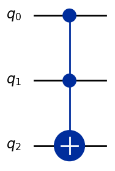

# Welcome to Qbricks


Qbricks is open-source environment for automated formal verification of  quantum programs. It enables the writing of quantum circuit building programs, specified with their I/O functions and/or their resource requirements. Thanks to a characterization of quantum circuits as _paramatrized path-sums_, 
the specifications of Qbricks  circuit-building quantum programs reduces to first-order proof obligations. Its host language,  the [Why3](http://why3.lri.fr/) deductive verification environment, provides an interface with SMT-solvers, enabling an high-level of automation in the vertfication of Qbricks specifications.

So far, Qbricks framework enabled the verified implementation of several emblematic algorithm from the litterature, including the Deutsch-Jozsa algorithm, Quantum Phase Estimation (QPE), Grover search algorithm and Shor order finding (including an implementation of the oracle).


It is developed at the [CEA LIST](http://www-list.cea.fr/en/) [(part of Université Paris-Saclay)](https://www.universite-paris-saclay.fr/en) in collaboration with [Laboratoire Méthodes Formelles](https://lmf-paris-saclay.fr/newsite/)[(Université Paris-Saclay)](https://www.universite-paris-saclay.fr/en).


For an introduction to Qbricks, please read our [article](https://github.com/Qbricks/qbricks.github.io/files/6414263/final--ESOP-2021.pdf) and see the related presentation [slides](https://github.com/Qbricks/qbricks.github.io/files/6419798/main.pdf). A tutorial redaction is under progress.


### PostDoc open position (2 years) : verified compilation 

The goal of this post-doctoral position is to extend  formal verification practice to quantum compilation.  Possibilities include, among others, error correction mechanisms in certified quantum code, together with specifications and reasoning technique for certifying its reliability, automatized certified optimizer for quantum circuits, hardware agnostic assembly language together with its compiler,

Keywords: quantum programming, compilation, optimization, formal verification

### How to apply

Applications should be sent to christophe.chareton@cea.fr as soon as possible (first come, first served) and by early July 2021 at the latest. Candidates should send a CV, a cover letter, a transcript of all their university results, as well as contact information of two references. Each  position is expected to start in October 2021.

Advisors:  Christophe Chareton (CEA), Sébastien Bardin (CEA)
Contact: christophe.chareton@cea.fr


# News 

- **Ongoing Postdoc** _June 2023_ Welcome, Nicolas Blanco, working on parametrized path-sums reewriting.
- **New relase** _March 2023_ Qbricks_1 is online! Available on main branch in [diffusion](https://github.com/Qbricks/qbricks.github.io), under License LGPL, 2.1. As main novelties the release provides:
  - LANGUAGE : new primitive constructs, containing (1) generic wiring and subcircuit control features (2) further gate constructors as primitives (Toffoli, Fredkin, X,Y,Z rotations, etc).
   - COMPILATION : a fully formally verified circuit transformation process, targetting Oqasm compatibile circuit, and an oqasm output generating function. Works for circuit without ancilla qbits. 
   - CASE STUDIES : new implementations of Shor algorithm, illutrating imperative QBricks styled programmation and the Oqasm extraction functionality.
- **Our code is back** to open source [diffusion](https://github.com/Qbricks/qbricks.github.io), under License LGPL, 2.1,  _April 2022_ .
- **Ongoing internship** _April 2022_ Welcome, Mohamed Bassiouny, working on automated circuit equivalence verification.
- **Book chapter submission** _March 2022_ Our survey on formal methods in quantum computing was submitted, as a Book Chapter to appear in the " "Handbook of Formal Analysis and Verification in Cryptography" (CRC), see the [preprint](https://arxiv.org/abs/2109.06493).
- **Ongoing PhD** _March 2022_ Welcome, Jérôme Ricciardi, working on mixed path-sums.
- **Ongoing internship** _February 2022_ Welcome, Tomas Barros Carneiro, working on an imperative developement interface for quantum formal verification.
- **Presentation at IQFA** _Nov 2021_ Qbricks was presented at the [12th Colloquium on Quantum Engineering, Fundamental Aspects to Applications](https://iqfacolloq2021.sciencesconf.org/), 2021 [(slides)](https://github.com/Qbricks/qbricks.github.io/files/7526625/IQFA_21.pdf).
- **Online survey** [Formal Methods for Quantum Programs: A Survey](https://arxiv.org/abs/2109.06493) _September 2021_. 
- **Presentation at QPL** _June 2021_ Qbricks was presented at the 2021 online QPL conference [(slides)](https://github.com/Qbricks/qbricks.github.io/files/6630309/main.pdf).
- **Qbricks at ESOP**        _March 2021_  Glad to participate to the 2021 online ESOP conference [(slides)](https://github.com/Qbricks/qbricks.github.io/files/6419798/main.pdf).
-   **Paper accepted**        _December 2020_  Proud that our paper “An Automated Deductive Verification Framework for Circuit-building Quantum Programs” has been [accepted](https://github.com/Qbricks/qbricks.github.io/files/6414263/final--ESOP-2021.pdf) at ESOP’21.
- **Online preprint** _March, 2020_ Our preprint _Toward certified quantum programming_ is availeble on [Arxiv](https://arxiv.org/abs/2003.05841v1)
- **Talk at IWQC** _November, 2020_, with online [presentation](https://www.youtube.com/watch?v=HKlCr5ulTh0&ab_channel=CambridgeQuantumComputing)


# People

| Name      |     Position     |        Affiliation | Web site  |
| :------------ | :-------------: | :------------- |:------------- |
| Sébastien Bardin      |     Senior     |   [CEA LIST](http://www-list.cea.fr/en/), [Université Paris-Saclay](https://www.universite-paris-saclay.fr/en) | [Sébastien Bardin](http://sebastien.bardin.free.fr/)|
| Benoît Valiron   |   Senior   |  [LMF](https://lmf-paris-saclay.fr/newsite/), [Université Paris-Saclay](https://www.universite-paris-saclay.fr/en) |[Benoît Valiron](https://www.monoidal.net/) |
| Christophe Chareton        |     Junior      |  [CEA LIST](http://www-list.cea.fr/en/), [Université Paris-Saclay](https://www.universite-paris-saclay.fr/en) |[Christophe Chareton](https://sites.google.com/site/christophechareton/) |
| Jérôme Ricciardi        |     PhD student      |  [CEA LIST](http://www-list.cea.fr/en/), [Université Paris-Saclay](https://www.universite-paris-saclay.fr/en) | [Jérôme Ricciardi](https://www.researchgate.net/profile/Jerome_Ricciardi)|
| Tomas Barros Carneiro        |     Intern      |  [CEA LIST](http://www-list.cea.fr/en/), [Université Paris-Saclay](https://www.universite-paris-saclay.fr/en) |[Tomas Barros Carneiro](https://github.com/tbc23)|
| Mohamed Bassiouny        |     Intern      |  [CEA LIST](http://www-list.cea.fr/en/), [Université Paris-Saclay](https://www.universite-paris-saclay.fr/en) |[Mohamed Bassiouny](http://mohamedh.me)|

# Publications

## International conference

- [An Automated Deductive Verification Framework for Circuit-building Quantum Programs](https://github.com/Qbricks/qbricks.github.io/files/6414263/final--ESOP-2021.pdf), _March, 2021_ at ESOP’21.

## Survey
- [Formal Methods for Quantum Programs: A Survey](https://arxiv.org/abs/2109.06493), 09/2021. Due to the destructive aspect of quantum measurement, formal methods are prone to play a decisive role in the emerging field of quantum software. In this survey, we present the challenges adressed to formal verificatio at every stage of the quantum  development process: high-level program design, implementation, compilation, etc. and we introduce  the current  most promising research directions

## Preprint 


- [Toward certified quantum programming](https://github.com/Qbricks/qbricks.github.io/files/6415756/2003.05841v1.pdf), _March, 2020_

## Short articles

- A formally certified implementation of Shor algorithm quantum circuit, _IWQC, November 2020_ 
[video](https://www.youtube.com/watch?v=HKlCr5ulTh0&ab_channel=CambridgeQuantumComputing)
- [Qbricks, a framework for formal verification in quantum
computing](https://github.com/Qbricks/qbricks.github.io/files/6415909/Qbricks_Planqc.7.pdf)  _PlanQC, January 2020_ [video](https://www.youtube.com/watch?v=_6EhDf5IDuw&ab_channel=ACMSIGPLAN)
- [Toward_certified_quantum_programming_](https://github.com/Qbricks/qbricks.github.io/files/6415879/Toward_certified_quantum_programming_This_work_was_supported_by_the_French_National_Research_Agency__ANR___project_SoftQPro__ANR_17_CE25_0009.3.1.pdf)  _IWQC, November,2018_  (2nd International Workshop on Quantum Compilation).(link)

# Installation

## Installation with Docker

**Please note that all the following tools are external tools, please refer to their webpage for more information.**

### Licence

- Docker: [licence](https://www.docker.com/legal/docker-software-end-user-license-agreement/)

- CVC3: [licence](https://cs.nyu.edu/acsys/cvc3/doc/LICENSE.html)

- CVC4: [licence](https://github.com/CVC4/CVC4-archived/blob/master/COPYING)

- CVC5: [licence](https://github.com/cvc5/cvc5/tree/main/licenses)

- Z3: [licence](https://github.com/Z3Prover/z3/blob/master/LICENSE.txt)

- Alt-Ergo: [licence](https://github.com/OCamlPro/alt-ergo/blob/next/LICENSE.md)

- Why3: [licence](https://gitlab.inria.fr/why3/why3/-/blob/master/LICENSE)

- OCaml: [licence](https://github.com/ocaml/ocaml/blob/trunk/LICENSE)

- Qiskit: [licence](https://github.com/Qiskit/qiskit/blob/main/LICENSE.txt)

- OpenQASM: [licence](https://github.com/openqasm/openqasm/blob/main/LICENSE)

- Matplotlib: [licence](https://github.com/matplotlib/matplotlib/blob/main/LICENSE/LICENSE)

### Installation

1. [Docker installation](https://docs.docker.com/engine/install/)

2. [Post-installation steps for Linux](https://docs.docker.com/engine/install/linux-postinstall/)

3. Build Docker image `make build` (alternative `make pull`)

4. Build container `make container`

5. Start container `make start`

# Quick Start - Examples

## Proof

Open [`shor.mlw`](https://github.com/Qbricks/qbricks.github.io/blob/main/Case_studies/shor.mlw) with [`why3-ide`](https://www.why3.org/doc/manpages.html#the-ide-command):

1. `cd Case_studies/`

2. `make ide_shor`


## Qbricks to OpenQASM

Example: [Toffoli](https://fr.wikipedia.org/wiki/Porte_de_Toffoli) 
<div style="text-align: center;">
  
</div>

1. Write
`let run() : string = string_oq (toffoli 0 1 2 3)`
in [`Qbricks_to_oqasm/Examples/To_openqasm_examples.mlw`](https://github.com/Qbricks/qbricks.github.io/blob/main/Qbricks_to_oqasm/Examples/To_openqasm_examples.mlw)

2. Translate
   - `make run_to_openqasm` (includes extraction from WhyML to OCaml and OCaml compilation)
   - `make run_to_openqasm_ne`

3. Retrieve the OpenQASM file: `extracted/To_openqasm_examples.qasm`

```
OPENQASM 2.0;
include "qelib1.inc";
qreg q[3];
h q[2];
u1 (2 * pi / 2^(3)) q[0];
rz (2 * pi / 2^(3)) q[2];
cx q[0], q[2];
rz (- 2 * pi / 2^(3)) q[2];
cx q[0], q[2];
u1 (2 * pi / 2^(3)) q[1];
rz (2 * pi / 2^(3)) q[2];
cx q[1], q[2];
rz (- 2 * pi / 2^(3)) q[2];
cx q[1], q[2];
cx q[0], q[1];
u1 (- 2 * pi / 2^(3)) q[1];
rz (- 2 * pi / 2^(3)) q[2];
cx q[1], q[2];
rz (2 * pi / 2^(3)) q[2];
cx q[1], q[2];
cx q[0], q[1];
h q[2];
```

## Qiskit simulation

### Simulation

To simulate `toffoli 0 1 2 3` on [Qiskit Aer Simulator](https://qiskit.github.io/qiskit-aer/stubs/qiskit_aer.AerSimulator.html):

```
python3 scripts/run_to_qiskit.py extracted/To_openqasm_examples.qasm
Testing all possible input states for the given quantum circuit:
Verification completed in 0.01 seconds.
```

To simulate `toffoli 0 1 2 3` on [Qiskit Aer Simulator](https://qiskit.github.io/qiskit-aer/stubs/qiskit_aer.AerSimulator.html) with verbose mode (displays circuits and results):
```
python3 scripts/run_to_qiskit.py extracted/To_openqasm_examples.qasm true
Testing all possible input states for the given quantum circuit:
Circuit for input state 000:
     ┌─────────┐                                                                                                                    ┌─┐   »
q_0: ┤ U1(π/4) ├─────────────■────────────────■────────────────────────────────────────■─────────────────────────────────────────■──┤M├───»
     ├─────────┤             │                │                                      ┌─┴─┐    ┌──────────┐                     ┌─┴─┐└╥┘┌─┐»
q_1: ┤ U1(π/4) ├─────────────┼────────────────┼───────────────■────────────────■─────┤ X ├────┤ U1(-π/4) ├──■───────────────■──┤ X ├─╫─┤M├»
     └──┬───┬──┘┌─────────┐┌─┴─┐┌──────────┐┌─┴─┐┌─────────┐┌─┴─┐┌──────────┐┌─┴─┐┌──┴───┴───┐└──────────┘┌─┴─┐┌─────────┐┌─┴─┐├───┤ ║ └╥┘»
q_2: ───┤ H ├───┤ Rz(π/4) ├┤ X ├┤ Rz(-π/4) ├┤ X ├┤ Rz(π/4) ├┤ X ├┤ Rz(-π/4) ├┤ X ├┤ Rz(-π/4) ├────────────┤ X ├┤ Rz(π/4) ├┤ X ├┤ H ├─╫──╫─»
        └───┘   └─────────┘└───┘└──────────┘└───┘└─────────┘└───┘└──────────┘└───┘└──────────┘            └───┘└─────────┘└───┘└───┘ ║  ║ »
c: 3/════════════════════════════════════════════════════════════════════════════════════════════════════════════════════════════════╩══╩═»

Input: 000 (q2, q1, q0)
Output: 000 (q2, q1, q0)
...
     ┌───┐┌─────────┐                                                                                                                    ┌─┐»
q_0: ┤ X ├┤ U1(π/4) ├─────────────■────────────────■────────────────────────────────────────■─────────────────────────────────────────■──┤M├»
     ├───┤├─────────┤             │                │                                      ┌─┴─┐    ┌──────────┐                     ┌─┴─┐└╥┘»
q_1: ┤ X ├┤ U1(π/4) ├─────────────┼────────────────┼───────────────■────────────────■─────┤ X ├────┤ U1(-π/4) ├──■───────────────■──┤ X ├─╫─»
     ├───┤└──┬───┬──┘┌─────────┐┌─┴─┐┌──────────┐┌─┴─┐┌─────────┐┌─┴─┐┌──────────┐┌─┴─┐┌──┴───┴───┐└──────────┘┌─┴─┐┌─────────┐┌─┴─┐├───┤ ║ »
q_2: ┤ X ├───┤ H ├───┤ Rz(π/4) ├┤ X ├┤ Rz(-π/4) ├┤ X ├┤ Rz(π/4) ├┤ X ├┤ Rz(-π/4) ├┤ X ├┤ Rz(-π/4) ├────────────┤ X ├┤ Rz(π/4) ├┤ X ├┤ H ├─╫─»
     └───┘   └───┘   └─────────┘└───┘└──────────┘└───┘└─────────┘└───┘└──────────┘└───┘└──────────┘            └───┘└─────────┘└───┘└───┘ ║ »
c: 3/═════════════════════════════════════════════════════════════════════════════════════════════════════════════════════════════════════╩═»
                                                                                                                                          0 »
«           
«q_0: ──────
«     ┌─┐   
«q_1: ┤M├───
«     └╥┘┌─┐
«q_2: ─╫─┤M├
«      ║ └╥┘
«c: 3/═╩══╩═
«      1  2 
Input: 111 (q2, q1, q0)
Output: 011 (q2, q1, q0)
----------------------------------------
Verification completed in 0.06 seconds.          
```

### Equivalence Check

To check equivalence of `toffoli 0 1 2 3` compiled with Qbricks to OpenQASM with [Qiskit Aer Simulator](https://qiskit.github.io/qiskit-aer/stubs/qiskit_aer.AerSimulator.html):

```
python3 scripts/run_to_qiskit_equiv.py extracted/To_openqasm_examples.qasm Qbricks_to_oqasm/Examples/toffoli.qasm 
All input states result in identity. The two circuits are equivalent.
Verification time: 0.01 seconds
```

To check equivalence of `toffoli 0 1 2 3` compiled with Qbricks to OpenQASM with [Qiskit Aer Simulator](https://qiskit.github.io/qiskit-aer/stubs/qiskit_aer.AerSimulator.html) with verbose mode (displays circuits and results):
```
python3 scripts/run_to_qiskit_equiv.py extracted/To_openqasm_examples.qasm Qbricks_to_oqasm/Examples/toffoli.qasm true 
Testing equivalence by checking if the combined circuit results in identity for all input states:
Circuit for input state 000:
     ┌─────────┐                                                                                                                         ┌─┐»
q_0: ┤ U1(π/4) ├─────────────■────────────────■────────────────────────────────────────■─────────────────────────────────────────■────■──┤M├»
     ├─────────┤             │                │                                      ┌─┴─┐    ┌──────────┐                     ┌─┴─┐  │  └╥┘»
q_1: ┤ U1(π/4) ├─────────────┼────────────────┼───────────────■────────────────■─────┤ X ├────┤ U1(-π/4) ├──■───────────────■──┤ X ├──■───╫─»
     └──┬───┬──┘┌─────────┐┌─┴─┐┌──────────┐┌─┴─┐┌─────────┐┌─┴─┐┌──────────┐┌─┴─┐┌──┴───┴───┐└──────────┘┌─┴─┐┌─────────┐┌─┴─┐├───┤┌─┴─┐ ║ »
q_2: ───┤ H ├───┤ Rz(π/4) ├┤ X ├┤ Rz(-π/4) ├┤ X ├┤ Rz(π/4) ├┤ X ├┤ Rz(-π/4) ├┤ X ├┤ Rz(-π/4) ├────────────┤ X ├┤ Rz(π/4) ├┤ X ├┤ H ├┤ X ├─╫─»
        └───┘   └─────────┘└───┘└──────────┘└───┘└─────────┘└───┘└──────────┘└───┘└──────────┘            └───┘└─────────┘└───┘└───┘└───┘ ║ »
c: 3/═════════════════════════════════════════════════════════════════════════════════════════════════════════════════════════════════════╩═»
                                                                                                                                          0 »
«           
«q_0: ──────
«     ┌─┐   
«q_1: ┤M├───
«     └╥┘┌─┐
«q_2: ─╫─┤M├
«      ║ └╥┘
«c: 3/═╩══╩═
«      1  2 
Input: 000, Output: 000 - PASS
----------------------------------------
Circuit for input state 001:
        ┌───┐   ┌─────────┐                                                                                                              ┌─┐»
q_0: ───┤ X ├───┤ U1(π/4) ├──■────────────────■────────────────────────────────────────■─────────────────────────────────────────■────■──┤M├»
     ┌──┴───┴──┐└─────────┘  │   

...

«c: 3/═══════════╩══╩══╩═
«                0  1  2 
Input: 110, Output: 110 - PASS
----------------------------------------
Circuit for input state 111:
     ┌───┐┌─────────┐                                                                                                                    »
q_0: ┤ X ├┤ U1(π/4) ├─────────────■────────────────■────────────────────────────────────────■─────────────────────────────────────────■──»
     ├───┤├─────────┤             │                │                                      ┌─┴─┐    ┌──────────┐                     ┌─┴─┐»
q_1: ┤ X ├┤ U1(π/4) ├─────────────┼────────────────┼───────────────■────────────────■─────┤ X ├────┤ U1(-π/4) ├──■───────────────■──┤ X ├»
     ├───┤└──┬───┬──┘┌─────────┐┌─┴─┐┌──────────┐┌─┴─┐┌─────────┐┌─┴─┐┌──────────┐┌─┴─┐┌──┴───┴───┐└──────────┘┌─┴─┐┌─────────┐┌─┴─┐├───┤»
q_2: ┤ X ├───┤ H ├───┤ Rz(π/4) ├┤ X ├┤ Rz(-π/4) ├┤ X ├┤ Rz(π/4) ├┤ X ├┤ Rz(-π/4) ├┤ X ├┤ Rz(-π/4) ├────────────┤ X ├┤ Rz(π/4) ├┤ X ├┤ H ├»
     └───┘   └───┘   └─────────┘└───┘└──────────┘└───┘└─────────┘└───┘└──────────┘└───┘└──────────┘            └───┘└─────────┘└───┘└───┘»
c: 3/════════════════════════════════════════════════════════════════════════════════════════════════════════════════════════════════════»
                                                                                                                                         »
«          ┌─┐      
«q_0: ──■──┤M├──────
«       │  └╥┘┌─┐   
«q_1: ──■───╫─┤M├───
«     ┌─┴─┐ ║ └╥┘┌─┐
«q_2: ┤ X ├─╫──╫─┤M├
«     └───┘ ║  ║ └╥┘
«c: 3/══════╩══╩══╩═
«           0  1  2 
Input: 111, Output: 111 - PASS
----------------------------------------
All input states result in identity. The two circuits are equivalent.
Verification time: 0.05 seconds
```


